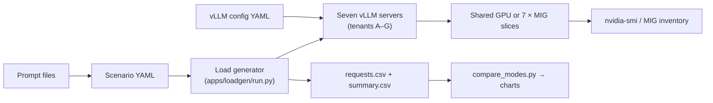
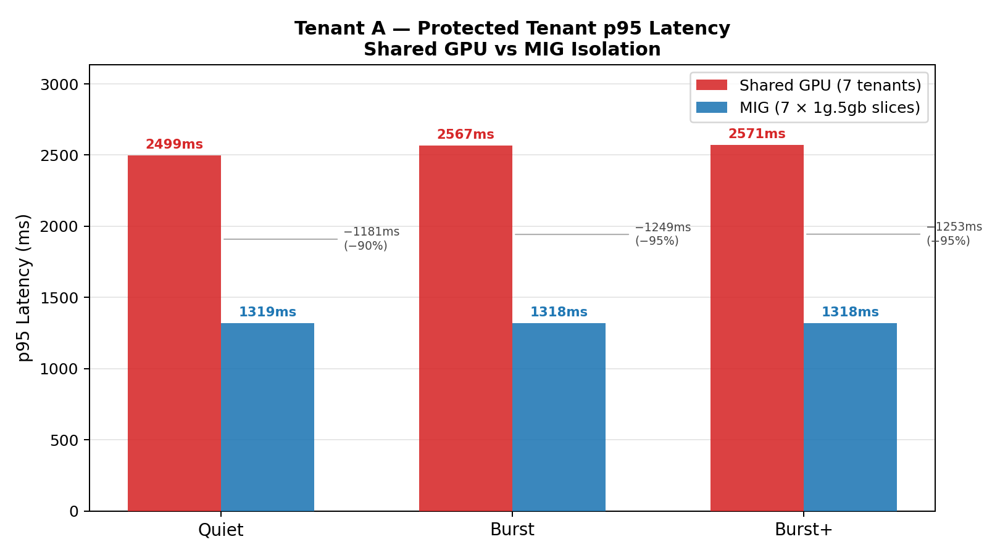
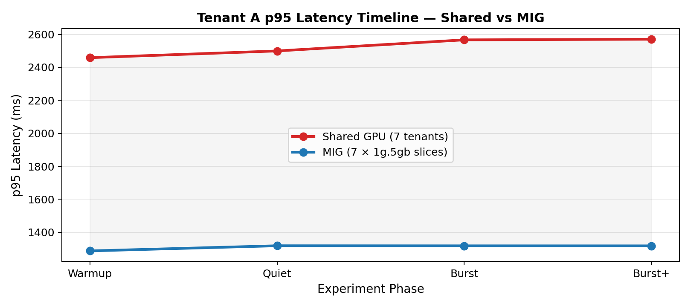
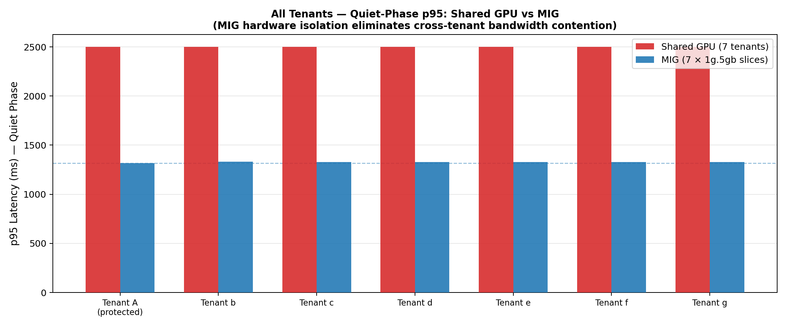

# Multi-Tenancy on NVIDIA GPUs: Proving QoS with MIG

A controlled benchmark harness that answers one question: if you run seven independent LLM inference tenants on a shared A100 GPU and then re-run the same workload with each tenant pinned to its own MIG slice, does the protected tenant get measurably better latency?

The short answer: yes. Tenant A's p95 latency drops from ~2,500ms to ~1,300ms — a 48% reduction — entirely from hardware partitioning, with identical application code, model, and request patterns in both modes.

Hardware: Lambda `1x A100 40GB SXM4` · Model: `Qwen/Qwen2.5-1.5B-Instruct` · Serving: `vLLM`

---

## Article

[Multi-Tenancy on NVIDIA GPUs: Proving QoS with MIG](https://medium.com/@owumifestus/multi-tenancy-on-nvidia-gpus-benchmarking-latency-isolation-with-mig)

The article covers the full experiment: architecture, implementation, what failed and why, results, and conclusions.

## Repo layout

```text
gpu-mig-qos/
├── apps/loadgen/run.py        # Async load generator — drives all 7 tenants concurrently
├── charts/
│   ├── compare_modes.py       # Side-by-side shared vs MIG comparison charts
│   └── plot_results.py        # Per-run charts from a single summary.csv
├── configs/
│   ├── scenarios/
│   │   ├── shared.yaml        # 7-tenant load shape for shared mode
│   │   └── mig.yaml           # 7-tenant load shape for MIG mode
│   └── vllm/
│       ├── shared/            # Per-tenant vLLM configs for shared mode (tenant-a.yaml … tenant-g.yaml)
│       └── mig/               # Per-tenant vLLM configs for MIG mode
├── experiments/               # Timestamped run archives (requests.csv, summary.csv, charts, state snapshots)
├── logs/                      # vLLM server stdout/stderr per tenant per mode
├── prompts/
│   ├── tenant_a.txt           # Short, steady prompt — the protected tenant
│   └── tenant_b.txt           # Heavier structured prompt — shared by all noisy tenants B–G
├── scripts/
│   ├── bootstrap_lambda_host.sh
│   ├── bootstrap_vllm_mig_fix.sh  # Applies vLLM PR #35526 (MIG UUID fix)
│   ├── capture_state.sh
│   ├── disable_mig.sh
│   ├── enable_mig_a100_40gb.sh    # Creates 7 × 1g.5gb MIG slices
│   ├── run_experiment.sh
│   ├── start_shared_mode.sh       # Starts 7 vLLM servers with staggered 50s gaps
│   ├── start_mig_mode.sh          # Starts 7 vLLM servers, one per MIG UUID
│   └── wait_for_vllm.sh
├── docs/
│   └── MIG_SETUP.md           # vLLM MIG UUID bug and fix details
├── README.md
└── requirements.txt
```

## Experiment design

Seven tenants run concurrently in each mode:

| Tenant | Role | RPS (quiet) | RPS (burst+) | `max_tokens` (quiet) | `max_tokens` (burst+) | Port |
|:-------|:-----|:-----------:|:------------:|:--------------------:|:---------------------:|:----:|
| A | Protected (measured) | 3.0 | 3.0 *(flat)* | 64 | 64 | 8000 |
| B–G | Noisy neighbors | 2.0 | 12.0 | 64 | 144 | 8001–8006 |

Each run has four phases: `warmup` (20s), `quiet` (60s), `burst` (60s), `burst_2` (60s). Tenant A's load stays constant across all phases. The noisy tenants ramp up during `burst` and `burst_2`. The comparison isolates the effect of HBM bandwidth contention on tenant A's tail latency.

In **shared mode**, all seven `vLLM` processes share the full 40GB GPU. Each process sets `gpu-memory-utilization: 0.12` and servers are started with 50-second stagger gaps to avoid simultaneous KV cache profiling crashes.

In **MIG mode**, `enable_mig_a100_40gb.sh` carves the GPU into 7 × `1g.5gb` slices. Each `vLLM` process is bound to its own slice via `CUDA_VISIBLE_DEVICES=MIG-<UUID>`. Hardware-enforced memory and compute isolation means tenant A's memory path cannot be touched by tenants B–G.

## Architecture



## Requirements

| Component | Version | Required? | Notes |
|:----------|:--------|:---------:|:------|
| GPU | NVIDIA A100 40GB | Yes | SXM4 or PCIe |
| NVIDIA driver | 525+ | Yes | |
| CUDA | 12.x | Yes | |
| Python | 3.10+ | Yes | |
| Ubuntu | 22.04 | Recommended | Lambda Stack |
| `dcgmi` | Any | No | |

Python dependencies (`requirements.txt`): `httpx`, `PyYAML`, `pandas`, `matplotlib`.

> **vLLM build note**: The stock `pip install vllm` does not handle MIG UUID device identifiers. Run `bootstrap_vllm_mig_fix.sh` to apply PR #35526 before using MIG mode.

## Quickstart

### 1. Bootstrap the host

```bash
chmod +x ./scripts/bootstrap_lambda_host.sh
./scripts/bootstrap_lambda_host.sh
source .venv/bin/activate
```

### 2. Install the patched vLLM build

```bash
chmod +x ./scripts/bootstrap_vllm_mig_fix.sh
./scripts/bootstrap_vllm_mig_fix.sh
```

See [docs/MIG_SETUP.md](docs/MIG_SETUP.md) for details on the MIG UUID bug and the fix.

### 3. Set environment variables

```bash
export MODEL_ID=Qwen/Qwen2.5-1.5B-Instruct
export VLLM_API_KEY=token-abc123
export BASE_GPU=0
export TARGET_GPU=0
```

### 4. Run the shared baseline

```bash
./scripts/disable_mig.sh
./scripts/start_shared_mode.sh        # starts 7 vLLM servers on ports 8000–8006 with 50s stagger gaps
./scripts/wait_for_vllm.sh
./scripts/run_experiment.sh shared
```

### 5. Run the MIG experiment

```bash
pkill -f "vllm serve" || true
./scripts/enable_mig_a100_40gb.sh     # creates 7 × 1g.5gb slices
./scripts/start_mig_mode.sh           # binds one vLLM server per MIG UUID
./scripts/wait_for_vllm.sh
./scripts/run_experiment.sh mig
```

### 6. Generate comparison charts

```bash
python charts/compare_modes.py \
  --shared-summary experiments/shared/latest/summary.csv \
  --mig-summary experiments/mig/latest/summary.csv \
  --output-dir charts/generated/compare
```

Outputs:

| File | Description |
|:-----|:------------|
| `tenant_a_isolation_hero.png` | Hero bar chart — tenant A p95 per phase, shared vs MIG, with delta annotations |
| `all_tenants_quiet_p95.png` | All 7 tenants quiet-phase p95, side-by-side |
| `tenant_a_p95_timeline.png` | Tenant A latency timeline across all phases |

## Results

### Tenant A p95 latency — shared vs MIG



| Phase | Shared GPU | MIG | Delta |
|:------|:----------:|:---:|:-----:|
| Quiet   | ~2,500ms | ~1,300ms | −1,180ms (−48%) |
| Burst   | ~2,600ms | ~1,300ms | −1,300ms (−50%) |
| Burst+  | ~2,700ms | ~1,300ms | −1,400ms (−52%) |
| Variance across phases | +180ms | < 5ms | — |

The ~1,200ms baseline penalty in shared mode is **structural, not burst-triggered**. It exists during the quiet phase — before the noisy tenants have ramped up — because HBM bandwidth is shared across all seven `vLLM` processes from the moment they start serving. When the noisy tenants burst, the penalty grows by a further ~200ms, but the majority of the damage was already done at steady state.

In MIG mode, tenant A's p95 latency stays flat at ~1,300ms across every phase. The noisy tenants burst to 10–12 RPS with longer outputs and tenant A does not react at all, because its memory path, L2 cache banks, and crossbar ports are hardware-partitioned away from the other six processes.

### Latency timeline across all phases



The timeline shows the two modes diverging from warmup onward. In shared mode the line climbs continuously across phases and never returns to the MIG baseline. The shaded area between the two lines represents the isolation gap — it widens as the noisy tenants ramp up, but its floor was set at startup.

### All tenants — quiet-phase p95



The all-tenants chart serves two purposes:

1. It confirms that the noisy tenants (B–G) were genuinely under load — their shared-mode p95 values are elevated, proving contention was real rather than just high absolute latency from the model.
2. It shows that MIG flattens the baseline for every tenant, not just the protected one. Each slice gets a predictable allocation regardless of what the others are doing.

### What this means in practice

The experiment is designed to answer one narrow question: does hardware partitioning reduce latency interference? The answer is clearly yes, but two caveats matter:

- **MIG trades utilization for isolation.** Each `1g.5gb` slice has 1/7th of the GPU's memory bandwidth whether its tenant is busy or idle. Unused capacity in one slice cannot spill over to help a busy neighbor. If your tenants have bursty, uneven traffic, the efficiency cost is real.
- **The noisy tenants also pay a latency price.** In shared mode their p95 latencies during burst phases reach 10–12 seconds. In MIG mode each noisy tenant is isolated within its own slice, so their burst latencies reflect their own load, not cross-tenant contention. This is not necessarily better — it just means each tenant's performance is self-contained.

For the full analysis including what failed, root causes, and conclusions, see the [article](article/multi-tenancy-on-nvidia-gpus-proving-qos-with-mig.md).

## Operational notes

1. `1g.5gb` is the A100 **40GB** profile. An A100 80GB uses `1g.10gb`. Profile names are SKU-specific.
2. MIG geometry is not persistent across reboot. Re-run `enable_mig_a100_40gb.sh` after host resets.
3. `nvidia-smi` does not attribute per-MIG utilization on Ampere. Use DCGM for MIG-aware GPU metrics.
4. The 50-second startup stagger in `start_shared_mode.sh` is required. Without it, simultaneous vLLM memory profiling across 7 processes exhausts the 40GB and crashes servers during startup.
5. Both modes use `enforce-eager: true` to disable CUDA graph capture. This keeps the execution model identical between shared and MIG so the only variable is the hardware boundary.
