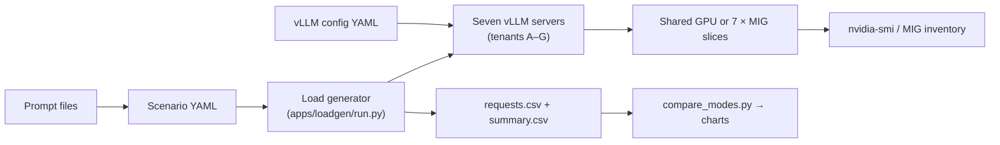

# Multi-Tenancy on NVIDIA GPUs: Proving QoS with MIG

A controlled benchmark harness that answers one question: if you run seven independent LLM inference tenants on a shared A100 GPU and then re-run the same workload with each tenant pinned to its own MIG slice, does the protected tenant get measurably better latency?

The short answer: yes. Tenant A's p95 latency drops from ~2,500ms to ~1,300ms — a 48% reduction — entirely from hardware partitioning, with identical application code, model, and request patterns in both modes.

Hardware: Lambda `1x A100 40GB SXM4` · Model: `Qwen/Qwen2.5-1.5B-Instruct` · Serving: `vLLM`

---

## Article

[Multi-Tenancy on NVIDIA GPUs: Proving QoS with MIG](https://medium.com/@owumifestus/multi-tenancy-on-nvidia-gpus-benchmarking-latency-isolation-with-mig)

The article covers the full experiment: architecture, implementation, what failed and why, results, and conclusions.

## Repo layout

```text
gpu-mig-qos/
├── apps/loadgen/run.py        # Async load generator — drives all 7 tenants concurrently
├── charts/
│   ├── compare_modes.py       # Side-by-side shared vs MIG comparison charts
│   └── plot_results.py        # Per-run charts from a single summary.csv
├── configs/
│   ├── scenarios/
│   │   ├── shared.yaml        # 7-tenant load shape for shared mode
│   │   └── mig.yaml           # 7-tenant load shape for MIG mode
│   └── vllm/
│       ├── shared/            # Per-tenant vLLM configs for shared mode (tenant-a.yaml … tenant-g.yaml)
│       └── mig/               # Per-tenant vLLM configs for MIG mode
├── experiments/               # Timestamped run archives (requests.csv, summary.csv, charts, state snapshots)
├── logs/                      # vLLM server stdout/stderr per tenant per mode
├── prompts/
│   ├── tenant_a.txt           # Short, steady prompt — the protected tenant
│   └── tenant_b_g.txt         # Heavier structured prompt — shared by all noisy tenants B–G
├── scripts/
│   ├── bootstrap_lambda_host.sh
│   ├── bootstrap_vllm_mig_fix.sh  # Applies vLLM [PR #35526](https://github.com/vllm-project/vllm/pull/35526) (MIG UUID fix)
│   ├── capture_state.sh
│   ├── disable_mig.sh
│   ├── enable_mig_a100_40gb.sh    # Creates 7 × 1g.5gb MIG slices
│   ├── run_experiment.sh
│   ├── start_shared_mode.sh       # Starts 7 vLLM servers with staggered 50s gaps
│   ├── start_mig_mode.sh          # Starts 7 vLLM servers, one per MIG UUID
│   └── wait_for_vllm.sh
├── docs/
│   └── MIG_SETUP.md           # vLLM MIG UUID bug and fix details
├── README.md
└── requirements.txt
```

## Codebase walkthrough

### `apps/`

This folder holds the actual benchmark harness. The key file is `apps/loadgen/run.py`. It reads a scenario YAML file, builds typed `Tenant` and `Phase` objects from it, fires async HTTP requests at each tenant's endpoint for the duration of each phase, and writes every result row to a CSV. The load shape is data-driven and can be changed independently of the runtime scripts.

The core data model is two small dataclasses:

```python
@dataclass
class Phase:
    name: str
    duration_s: float
    rps: float
    max_tokens: int
    temperature: float

@dataclass
class Tenant:
    name: str
    endpoint: str
    model: str
    prompt: str
    system_prompt: str
    concurrency: int
    timeout_s: float
    phases: list[Phase]
```

Each request is issued asynchronously via `httpx`. The rate is enforced with a simple token-bucket-style loop: one task is dispatched per `1/rps` seconds, with a semaphore capping outstanding concurrency.

```python
async def run_phase(client, api_key, tenant, phase, start_time, rows):
    semaphore = asyncio.Semaphore(tenant.concurrency)
    interval = 1.0 / phase.rps
    end_time = time.perf_counter() + phase.duration_s

    async def worker(scheduled_at):
        async with semaphore:
            row = await issue_request(client, api_key, tenant, phase, scheduled_at)
            rows.append(row)

    next_fire = time.perf_counter()
    while next_fire < end_time:
        now = time.perf_counter()
        if now < next_fire:
            await asyncio.sleep(next_fire - now)
        phase_tasks.append(asyncio.create_task(worker(time.perf_counter())))
        next_fire += interval

    await asyncio.gather(*phase_tasks)
```

Each row records `tenant`, `phase`, `status_code`, `latency_ms`, `prompt_tokens`, `completion_tokens`, and `error`. All seven tenants run their phases concurrently using `asyncio.gather`, so the load generator drives the full 7-tenant workload from a single process.

Before the timed run starts, the load generator fires one preflight request per unique `(tenant, max_tokens, temperature)` combination to catch misconfigured endpoints before any timing data is collected.

### `configs/`

This folder is where the project becomes declarative. There are two configuration families: `configs/vllm/` and `configs/scenarios/`.

`configs/vllm/` defines how each vLLM server process runs. Here is tenant A's shared-mode config:

```yaml
host: 0.0.0.0
port: 8000
dtype: half
max-model-len: 2048
max-num-seqs: 8
max-num-batched-tokens: 1024
gpu-memory-utilization: 0.12
enforce-eager: true
disable-log-stats: true
```

The key parameters are `gpu-memory-utilization` (what fraction of GPU memory this process is allowed to claim) and `enforce-eager` (forces PyTorch eager execution rather than CUDA graphs, which is required to keep the comparison honest between modes). Each tenant in each mode has its own file under `configs/vllm/shared/` or `configs/vllm/mig/`.

`configs/scenarios/` defines the benchmark itself. Here is tenant A's entry in `shared.yaml`, showing the 4-phase structure:

```yaml
tenant_a:
  endpoint: http://127.0.0.1:8000/v1
  model: ${MODEL_ID}
  prompt_path: ../../prompts/tenant_a.txt
  concurrency: 8
  phases:
    - name: warmup
      duration_s: 20
      rps: 1.0
      max_tokens: 64
      temperature: 0.0
    - name: quiet
      duration_s: 60
      rps: 3.0
      max_tokens: 64
      temperature: 0.0
    - name: burst
      duration_s: 60
      rps: 3.0
      max_tokens: 64
      temperature: 0.0
    - name: burst_2
      duration_s: 60
      rps: 3.0
      max_tokens: 64
      temperature: 0.0
```

Tenant A's RPS stays flat at 3.0 across all phases. The noisy tenants B through G ramp from 2.0 RPS at `quiet` to 10.0–12.0 RPS at `burst` and `burst_2`, with `max_tokens` jumping from 64 to 144 to generate more decode pressure. The `${MODEL_ID}` placeholder is expanded from the environment at runtime, which keeps the model selection out of the scenario file.

This split between server config and scenario config separates how the server behaves from how the workload behaves. That separation makes it easy to change one without touching the other.

### `scripts/`

This folder is the operational backbone of the project. Each script encodes one step in the experiment lifecycle and can be run independently.

`start_shared_mode.sh` shows the staggered startup pattern that solved the simultaneous memory profiling problem:

```bash
MODEL_ID="${MODEL_ID:-Qwen/Qwen2.5-1.5B-Instruct}"
BASE_GPU="${BASE_GPU:-0}"

# Tenant A starts first and gets 45 seconds to stabilize
CUDA_VISIBLE_DEVICES="${BASE_GPU}" \
vllm serve "${MODEL_ID}" \
  --config configs/vllm/shared/tenant-a.yaml \
  --api-key "${VLLM_API_KEY}" \
  >"${LOG_DIR}/tenant-a.log" 2>&1 &

sleep 45

# Each subsequent tenant waits 50s so vLLM memory profiling
# does not race with the next process loading its weights
CUDA_VISIBLE_DEVICES="${BASE_GPU}" \
vllm serve "${MODEL_ID}" \
  --config configs/vllm/shared/tenant-b.yaml \
  --api-key "${VLLM_API_KEY}" \
  >"${LOG_DIR}/tenant-b.log" 2>&1 &

sleep 50
# ... repeated through tenant G
```

`start_mig_mode.sh` does the same for MIG, but instead of a shared GPU index it resolves each `MIG-<UUID>` from `nvidia-smi -L` and binds each server to its own slice via `CUDA_VISIBLE_DEVICES`. This is the binding that enforces hardware isolation at the OS level.

`run_experiment.sh` ties everything together. It creates the timestamped output directory, calls `capture_state.sh` before and after the run, invokes the load generator, and then calls the charting scripts. A single `./scripts/run_experiment.sh shared` or `./scripts/run_experiment.sh mig` runs the full measurement cycle.

### `prompts/`

This folder is small, but conceptually important. The prompt files define the semantic shape of each tenant's workload, which directly affects how much decode work the model has to do per request.

Tenant A uses a short, tightly scoped prompt designed to produce a predictable, moderate-length response:

```text
Explain the Rust ownership model in two short paragraphs, then give a
six-line Rust example involving borrowing, and finish with two brief
bullet takeaways.
```

Tenants B through G share a heavier prompt designed to force a longer, more structured response and more tokens generated. This means more HBM reads per request — which is the pressure mechanism:

```text
You are helping a systems engineer compare GPU partitioning strategies.
Write a structured answer that explains the trade-offs between shared
GPUs, hard partitioning, and predictable latency for inference platforms.
Include a short list of operational risks and a short list of situations
where hard isolation is worth the cost.
```

Keeping prompts in files does two things: it makes the workload shape explicit and auditable, and it makes prompt changes show up as diffs in version control rather than buried inside a load-generator argument string.

### `experiments/`

This folder is the evidence archive. Every run produces a timestamped directory:

```text
experiments/shared/20260329-162848/
├── scenario.yaml          # exact scenario file used
├── scenario_resolved.json # scenario after env-var expansion
├── requests.csv           # one row per HTTP request
├── summary.csv            # p50/p95/p99/success per tenant per phase
├── state-before/          # nvidia-smi and MIG inventory pre-run
├── state-after/           # nvidia-smi and MIG inventory post-run
└── charts/                # per-run figures
```

`requests.csv` has one row per request across all tenants and phases, with columns for `tenant`, `phase`, `latency_ms`, `status_code`, `prompt_tokens`, `completion_tokens`, and `error`. `summary.csv` aggregates those into p50, p95, and p99 per `(tenant, phase)` pair — that is the file the charting scripts read.

This structure makes the benchmark auditable. Every claim in the results section has a corresponding artifact on disk.

### `logs/`

The `logs/` folder captures raw stdout/stderr from each vLLM server process, one file per tenant per mode:

```text
logs/shared/tenant-a.log
logs/shared/tenant-b.log
...
logs/mig/tenant-a.log
```

This is the first place to look when something fails. During development it was the most useful debugging surface, because it exposed the exact difference between _the GPU ran out of memory during KV cache allocation_ and _the request payload was malformed_. Those two errors look identical from the load generator's perspective — both return a non-200 status — but the server log shows the full stack trace.

### `charts/`

This folder turns the raw CSVs into figures. There are two scripts:

- **`plot_results.py`** — generates per-run charts for a single `summary.csv`. Called automatically by `run_experiment.sh` at the end of every run.
- **`compare_modes.py`** — loads both the shared and MIG summary CSVs and generates the side-by-side comparison figures. It takes explicit `--shared-summary` and `--mig-summary` arguments so the comparison is always between two specific identified runs rather than implicitly using whatever files happen to be in `latest/`. The three output figures — the hero bar chart, the all-tenants quiet-phase chart, and the tenant A timeline — are the ones used in the results section.

## Experiment design

Seven tenants run concurrently in each mode:

| Tenant | Role | RPS (quiet) | RPS (burst+) | `max_tokens` (quiet) | `max_tokens` (burst+) | Port |
|:-------|:-----|:-----------:|:------------:|:--------------------:|:---------------------:|:----:|
| A | Protected (measured) | 3.0 | 3.0 *(flat)* | 64 | 64 | 8000 |
| B–G | Noisy neighbors | 2.0 | 12.0 | 64 | 144 | 8001–8006 |

Each run has four phases: `warmup` (20s), `quiet` (60s), `burst` (60s), `burst_2` (60s). Tenant A's load stays constant across all phases. The noisy tenants ramp up during `burst` and `burst_2`. The comparison isolates the effect of HBM bandwidth contention on tenant A's tail latency.

In **shared mode**, all seven `vLLM` processes share the full 40GB GPU. Each process sets `gpu-memory-utilization: 0.12` and servers are started with 50-second stagger gaps to avoid simultaneous KV cache profiling crashes.

In **MIG mode**, `enable_mig_a100_40gb.sh` carves the GPU into 7 × `1g.5gb` slices. Each `vLLM` process is bound to its own slice via `CUDA_VISIBLE_DEVICES=MIG-<UUID>`. Hardware-enforced memory and compute isolation means tenant A's memory path cannot be touched by tenants B–G.

## Architecture



## Requirements

| Component | Version | Required? | Notes |
|:----------|:--------|:---------:|:------|
| GPU | NVIDIA A100 40GB | Yes | SXM4 or PCIe |
| NVIDIA driver | 525+ | Yes | |
| CUDA | 12.x | Yes | |
| Python | 3.10+ | Yes | |
| Ubuntu | 22.04 | Recommended | Lambda Stack |
| `dcgmi` | Any | No | |

Python dependencies (`requirements.txt`): `httpx`, `PyYAML`, `pandas`, `matplotlib`.

> **vLLM build note**: The stock `pip install vllm` does not handle MIG UUID device identifiers. Run `bootstrap_vllm_mig_fix.sh` to apply [PR #35526](https://github.com/vllm-project/vllm/pull/35526) before using MIG mode.

## Quickstart

### 1. Bootstrap the host

```bash
chmod +x ./scripts/bootstrap_lambda_host.sh
./scripts/bootstrap_lambda_host.sh
source .venv/bin/activate
```

### 2. Install the patched vLLM build

```bash
chmod +x ./scripts/bootstrap_vllm_mig_fix.sh
./scripts/bootstrap_vllm_mig_fix.sh
```


### 3. Set environment variables

```bash
export MODEL_ID=Qwen/Qwen2.5-1.5B-Instruct
export VLLM_API_KEY=token-abc123
export BASE_GPU=0
export TARGET_GPU=0
```

### 4. Run the shared baseline

```bash
./scripts/disable_mig.sh
./scripts/start_shared_mode.sh        # starts 7 vLLM servers on ports 8000–8006 with 50s stagger gaps
./scripts/wait_for_vllm.sh
./scripts/run_experiment.sh shared
```

### 5. Run the MIG experiment

```bash
pkill -f "vllm serve" || true
./scripts/enable_mig_a100_40gb.sh     # creates 7 × 1g.5gb slices
./scripts/start_mig_mode.sh           # binds one vLLM server per MIG UUID
./scripts/wait_for_vllm.sh
./scripts/run_experiment.sh mig
```

### 6. Generate comparison charts

```bash
python charts/compare_modes.py \
  --shared-summary experiments/shared/latest/summary.csv \
  --mig-summary experiments/mig/latest/summary.csv \
  --output-dir charts/generated/compare
```

Outputs:

| File | Description |
|:-----|:------------|
| `tenant_a_isolation_hero.png` | Hero bar chart — tenant A p95 per phase, shared vs MIG, with delta annotations |
| `all_tenants_quiet_p95.png` | All 7 tenants quiet-phase p95, side-by-side |
| `tenant_a_p95_timeline.png` | Tenant A latency timeline across all phases |

## Results

### Tenant A p95 latency — shared vs MIG


| Phase | Shared GPU | MIG | Delta |
|:------|:----------:|:---:|:-----:|
| Quiet   | ~2,500ms | ~1,300ms | −1,180ms (−48%) |
| Burst   | ~2,600ms | ~1,300ms | −1,300ms (−50%) |
| Burst+  | ~2,700ms | ~1,300ms | −1,400ms (−52%) |
| Variance across phases | +180ms | < 5ms | — |

The ~1,200ms baseline penalty in shared mode is **structural, not burst-triggered**. It exists during the quiet phase — before the noisy tenants have ramped up — because HBM bandwidth is shared across all seven `vLLM` processes from the moment they start serving. When the noisy tenants burst, the penalty grows by a further ~200ms, but the majority of the damage was already done at steady state.

In MIG mode, tenant A's p95 latency stays flat at ~1,300ms across every phase. The noisy tenants burst to 10–12 RPS with longer outputs and tenant A does not react at all, because its memory path, L2 cache banks, and crossbar ports are hardware-partitioned away from the other six processes.

### Latency timeline across all phases


The timeline shows the two modes diverging from warmup onward. In shared mode the line climbs continuously across phases and never returns to the MIG baseline. The shaded area between the two lines represents the isolation gap — it widens as the noisy tenants ramp up, but its floor was set at startup.

### All tenants — quiet-phase p95


The all-tenants chart serves two purposes:

1. It confirms that the noisy tenants (B–G) were genuinely under load — their shared-mode p95 values are elevated, proving contention was real rather than just high absolute latency from the model.
2. It shows that MIG flattens the baseline for every tenant, not just the protected one. Each slice gets a predictable allocation regardless of what the others are doing.

### What this means in practice

The experiment is designed to answer one narrow question: does hardware partitioning reduce latency interference? The answer is clearly yes, but two caveats matter:

- **MIG trades utilization for isolation.** Each `1g.5gb` slice has 1/7th of the GPU's memory bandwidth whether its tenant is busy or idle. Unused capacity in one slice cannot spill over to help a busy neighbor. If your tenants have bursty, uneven traffic, the efficiency cost is real.
- **The noisy tenants also pay a latency price.** In shared mode their p95 latencies during burst phases reach 10–12 seconds. In MIG mode each noisy tenant is isolated within its own slice, so their burst latencies reflect their own load, not cross-tenant contention. This is not necessarily better — it just means each tenant's performance is self-contained.

For the full analysis including what failed, root causes, and conclusions, see the [article](https://medium.com/@owumifestus/multi-tenancy-on-nvidia-gpus-benchmarking-latency-isolation-with-mig).
